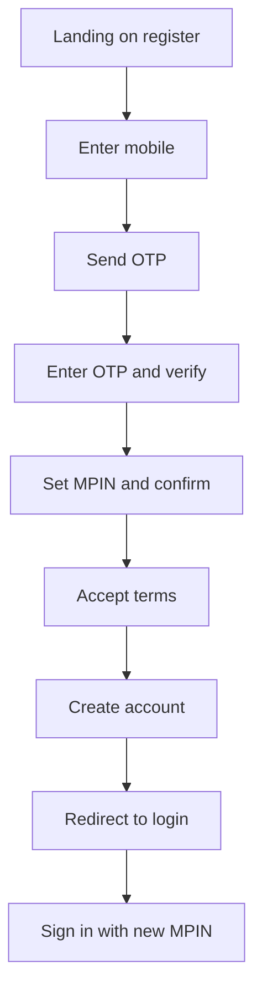

# Module 01 — Register

**Hub module:** Register  
**Route:** `/temple-register`  
**Previous:** — · **Next:** [02-login.md](./02-login.md)

---

## 1. Business Context

New SMB/freelancer vendors (caterers, priests, hotels, etc.) need a **fast account** before accessing DigiDevalaya Business Connect. Register collects only identity credentials — mobile verification and MPIN. Business details, KYC, and GST are deferred to **Business Profile** (module 03).

**In scope:** Mobile OTP, MPIN, terms acceptance, account creation.  
**Out of scope:** Business name, documents, payment, profile data.

---

## 2. Business Objectives

| Objective | Success metric |
|-----------|----------------|
| Minimize signup friction | ≤ 3 screens; &lt; 2 min completion |
| Verify real mobile number | OTP verified before account created |
| Secure quick re-login | 4-digit MPIN set at signup |
| Clean onboarding handoff | User lands on login with mobile prefilled |
| One account per mobile | No duplicate registrations (production) |

---

## 3. Personas

| Persona | Goal | Pain point |
|---------|------|------------|
| **New vendor (Priya)** | Create account quickly on phone | Long forms at signup |
| **Returning mistap** | Switch to login | Accidentally on register page |

---

## 4. User Journey



| Step | User action | System response |
|------|-------------|-----------------|
| 1 | Enter 10-digit mobile | Enable Send OTP |
| 2 | Tap Send OTP | Show OTP field (SMS in production) |
| 3 | Enter OTP, Verify | Lock mobile; show MPIN fields |
| 4 | Set MPIN + confirm | Validate match |
| 5 | Check terms | Enable Create account |
| 6 | Create account | Save account; clear old data; go to login |

**Alternate paths:**
- MPIN mismatch → inline error, cannot submit
- Already registered mobile → error at OTP send (production)
- “Already have account?” → link to login

---

## 5. Screen Inventory

| Screen | Route | Entry | Exit |
|--------|-------|-------|------|
| Create account | `/temple-register` | Login link, marketing | `/login` on success |

**Layout:** Standalone full-page (no app shell).

**Sections:** Header · Mobile · OTP · MPIN · Terms · CTA · Footer link to login

---

## 6. UI Requirements

### Fields & validation

| Field | Required | Format | Error message |
|-------|----------|--------|---------------|
| Mobile | Yes | 10 digits, numeric | Button disabled if &lt; 10 |
| OTP | Yes | 6 digits | Button disabled if &lt; 6 |
| MPIN | Yes | 4 digits | — |
| Confirm MPIN | Yes | Match MPIN | **"MPINs do not match"** |
| Terms | Yes | Checked | Button disabled if unchecked |

### Submit gate
`otpVerified && mobile.length === 10 && mpinReady && termsAccepted`

### UI states

| State | Display |
|-------|---------|
| Initial | Mobile + Send OTP |
| OTP sent | OTP input + Verify |
| Verified | Green banner + MPIN grid |
| Saving | “Creating account…” |
| Error | Toast (API failures) |

### Visual
- Mobile: `+91` prefix, placeholder `98765 43210`
- OTP: centered monospace
- MPIN: two password fields, 4-digit
- Info callout: profile setup happens after signup

---

## 7. Data Model

```typescript
interface RegistrationAccount {
  mobile: string;       // 10 digits
  mpinHash?: string;    // production only
  registeredAt: string; // ISO 8601
  termsVersion?: string;
}
```

---

## 8. Business Rules

| ID | Rule |
|----|------|
| BR-REG-01 | Collect only mobile, OTP, MPIN, terms — no business data |
| BR-REG-02 | Country code fixed +91 |
| BR-REG-03 | OTP verified before MPIN shown |
| BR-REG-04 | Mobile locked after OTP verified |
| BR-REG-05 | MPIN must match confirm MPIN |
| BR-REG-06 | Terms must be explicitly accepted |
| BR-REG-07 | Redirect to login on success — never into app |
| BR-REG-08 | One account per mobile (production) |
| BR-REG-09 | New registration clears profile + onboarding flags |
| BR-REG-10 | MPIN exactly 4 numeric digits |

### OTP (production)

| Rule | Value |
|------|-------|
| Length | 6 digits |
| Expiry | 5 minutes |
| Resend cooldown | 30 seconds |
| Max attempts | 3 per OTP |
| Rate limit | 5 sends / mobile / hour |

---

## 9. Workflow States

| State | Description | Next |
|-------|-------------|------|
| `anonymous` | No account | OTP flow |
| `otp_pending` | OTP sent, not verified | Verify or resend |
| `otp_verified` | Mobile confirmed | MPIN entry |
| `ready_to_create` | MPIN + terms valid | Create account |
| `account_created` | Saved | Redirect login |

**Flags set on create:** `businessProfileSetupRequired`, onboarding reset.

---

## 10. API Requirements

### `POST /auth/otp/send`
```json
{ "mobile": "9876543210", "countryCode": "+91", "purpose": "register" }
```
Errors: `MOBILE_ALREADY_REGISTERED` 409, `RATE_LIMITED` 429, `INVALID_MOBILE` 400

### `POST /auth/otp/verify`
```json
{ "mobile": "9876543210", "otp": "123456", "purpose": "register" }
```
Response: `{ "verified": true, "verificationToken": "vt_..." }`

### `POST /auth/register`
```json
{ "mobile": "9876543210", "verificationToken": "vt_...", "mpin": "1234", "termsAccepted": true }
```
Response: `{ "userId", "mobile", "onboardingStep": "profile" }`  
Security: Hash MPIN server-side.

**Prototype:** OTP any 6 digits; localStorage only.

---

## 11. Permissions

| Actor | Can register |
|-------|--------------|
| Anonymous visitor | Yes |
| Logged-in user | Redirect to hub (target) |

No role-based differences at register.

---

## 12. Notifications

| Event | Channel | Message |
|-------|---------|---------|
| Account created | Toast | “Account created successfully” |
| Account created | Toast description | “Sign in with your mobile and MPIN…” |
| OTP sent | SMS (production) | 6-digit code |
| Duplicate mobile | Toast/API | “Account exists — sign in” |

---

## 13. Reports

| Report | Purpose | Phase |
|--------|---------|-------|
| Registrations per day | Funnel analytics | v2 |
| OTP failure rate | SMS/debug | v2 |
| Drop-off by step | UX optimization | v2 |

Not required for v1 prototype.

---

## 14. Acceptance Criteria

**AC-REG-01** — Given 10-digit mobile, when Send OTP, then OTP field appears.  
**AC-REG-02** — Given valid OTP, when Verify, then MPIN section shows and mobile locks.  
**AC-REG-03** — Given MPIN ≠ confirm, when both 4 digits, then “MPINs do not match”.  
**AC-REG-04** — Given all valid + terms, when Create account, then login opens with mobile prefilled.  
**AC-REG-05** — Given terms unchecked, then Create account disabled.

---

## 15. Test Scenarios

| ID | Scenario | Steps | Expected |
|----|----------|-------|----------|
| TS-REG-01 | Happy path | Full signup flow | Account on login |
| TS-REG-02 | Short mobile | 9 digits | Send OTP disabled |
| TS-REG-03 | MPIN mismatch | 1234 / 5678 | Inline error |
| TS-REG-04 | No terms | Valid fields, no check | Button disabled |
| TS-REG-05 | Duplicate mobile | Register twice (API) | 409 error |
| TS-REG-06 | OTP invalid | Wrong 6 digits | Verify blocked / error |
| TS-REG-07 | Navigate to login | Footer link | `/login` opens |
