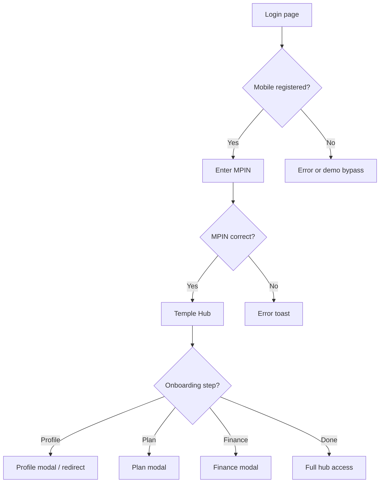

# Module 02 — Login

**Hub module:** Login (+ Temple Hub entry & onboarding guard)  
**Routes:** `/login`, `/forgot-mpin` → `/temple-hub`  
**Previous:** [01-register.md](./01-register.md) · **Next:** [03-business-profile.md](./03-business-profile.md)

---

## 1. Business Context

Registered business users authenticate with **mobile + MPIN** and enter the platform via **Temple Hub** — the dashboard that orchestrates remaining onboarding (profile → plan → finance → services). This module covers sign-in, forgot MPIN, route guards, and hub onboarding modals.

---

## 2. Business Objectives

| Objective | Success metric |
|-----------|----------------|
| Fast return access | Login in &lt; 10 seconds |
| Secure credentials | MPIN validation; lockout after failures (target) |
| Guide incomplete onboarding | 100% of gated users see correct next step |
| Prevent wrong-module access | Route guard blocks until onboarding done |

---

## 3. Personas

| Persona | Goal |
|---------|------|
| **Returning vendor (Priya)** | Sign in and continue profile or listings |
| **New vendor (post-register)** | Sign in with MPIN just created |
| **Forgot MPIN user** | Recover access via OTP |

---

## 4. User Journey

### Sign in


### Hub onboarding modals (after login)

| Step | Modal | Primary CTA | Goes to |
|------|-------|-------------|---------|
| Profile | Set up business profile | Set up | `/business/profile?setup=1` |
| Plan | Choose your plan | View Plans | `/temple/settings/upgrade` |
| Finance | Complete finance setup | Go to Finance | `/temple/settings/finance` |

### Forgot MPIN
Mobile → OTP → New MPIN → Success → Login

---

## 5. Screen Inventory

| Screen | Route | Purpose |
|--------|-------|---------|
| Sign in | `/`, `/login` | Primary auth |
| Forgot MPIN | `/forgot-mpin` | Recovery wizard |
| Temple Hub | `/temple-hub` | Post-login home (exit of this module) |

---

## 6. UI Requirements

### Login fields

| Field | Required | Format | Error message |
|-------|----------|--------|---------------|
| Phone | Yes | 10 digits | — |
| MPIN | Yes | 4 digits | “Enter your 4-digit MPIN” |

### Login errors

| Condition | Message |
|-----------|---------|
| Unregistered mobile | “No account found for this mobile number. Please register first.” |
| Wrong MPIN | “Incorrect MPIN. Try again or use Forgot MPIN.” |

### Forgot MPIN

| Step | Validation | Error |
|------|------------|-------|
| Mobile | 10 digits | “Enter a valid 10-digit mobile number” |
| OTP | 6 digits | “Enter the 6-digit OTP” |
| New MPIN | 4 digits, match | “MPINs do not match” |

### UI behaviour
- Subtitle for `newAccount` arrivals from register
- Demo bypass hidden when registration exists (prototype only)
- Guard toasts: info, 5s duration
- Hub modals: non-dismissible for business users; “Remind me later” snoozes session

---

## 7. Data Model

```typescript
type OnboardingStep = "profile" | "subscription" | "finance" | "done";

interface AuthSession {
  userId: string;
  mobile: string;
  onboardingStep: OnboardingStep;
  accessToken?: string;
  refreshToken?: string;
}
```

---

## 8. Business Rules

| ID | Rule |
|----|------|
| BR-LOGIN-01 | Auth = mobile + MPIN for business users |
| BR-LOGIN-02 | Success → always Temple Hub first |
| BR-LOGIN-03 | Global route guard until onboarding `done` |
| BR-LOGIN-04 | Profile incomplete → limited routes only |
| BR-LOGIN-05 | No plan → settings/finance unlocked; other modules locked |
| BR-LOGIN-06 | Finance incomplete → services blocked |
| BR-LOGIN-07 | Forgot MPIN must update credential (production) |
| BR-HUB-01 | One hub modal at a time by onboarding step |
| BR-HUB-02 | Modal snooze = session only |
| BR-HUB-03 | Locked module click → upgrade prompt |

### Route guard matrix

| State | Redirect | Toast |
|-------|----------|-------|
| Profile incomplete | `/business/profile?setup=1` | “Complete your business profile first” |
| No plan | `/temple-hub` | “Choose a plan to unlock this module” |
| Finance incomplete | `/temple-hub` | “Complete finance setup” |

### Allowed routes

| Step | Allowed |
|------|---------|
| Profile incomplete | login, register, hub, profile, forgot-mpin, explore |
| No plan | hub, profile, settings, finance, explore |
| Finance step | hub, profile, settings, finance |

---

## 9. Workflow States

| Onboarding step | Trigger | Unlocks |
|-----------------|---------|---------|
| `profile` | Login; profile incomplete | Profile module |
| `subscription` | Profile complete | Settings, finance |
| `finance` | Plan complete | Finance setup |
| `done` | Default donation bank set | All modules incl. services |

**Session states:** `unauthenticated` → `authenticated` → `onboarding_*` → `active`

**Logout (target):** Clear tokens → `/login`

---

## 10. API Requirements

### `POST /auth/login`
```json
{ "mobile": "9876543210", "mpin": "1234" }
```
Response: `{ accessToken, refreshToken, user: { id, mobile, onboardingStep } }`  
Errors: `INVALID_CREDENTIALS` 401, `ACCOUNT_LOCKED` 423

### `POST /auth/mpin/forgot` · `POST /auth/mpin/reset` · `GET /auth/session`

**Prototype:** localStorage credential check; no JWT; forgot MPIN mock (does not update MPIN).

---

## 11. Permissions

| Actor | Login | Hub | Gated modules |
|-------|-------|-----|---------------|
| Business user (registered) | Yes | Yes | Per onboarding step |
| Demo user (no registration) | Bypass (prototype) | Full | All |
| Anonymous | Login/register only | No | No |

---

## 12. Notifications

| Event | Message |
|-------|---------|
| Wrong MPIN | “Incorrect MPIN. Try again or use Forgot MPIN.” |
| No account | “No account found for this mobile number. Please register first.” |
| Guard: profile | “Complete your business profile first” |
| Guard: plan | “Choose a plan to unlock this module” |
| Guard: finance | “Complete finance setup” |
| OTP sent (forgot) | “OTP sent to your mobile number” |

---

## 13. Reports

| Report | Phase |
|--------|-------|
| Login success/failure rate | v2 |
| Onboarding drop-off by step | v2 |
| Forgot MPIN completion rate | v2 |

---

## 14. Acceptance Criteria

**AC-LOGIN-01** — Valid credentials → Temple Hub.  
**AC-LOGIN-02** — Wrong MPIN → error with forgot hint.  
**AC-LOGIN-03** — Incomplete profile + deep link to services → profile setup redirect.  
**AC-LOGIN-04** — Hub shows correct modal for current onboarding step.  
**AC-LOGIN-05** — Forgot MPIN complete → can sign in with new MPIN (production).

---

## 15. Test Scenarios

| ID | Scenario | Expected |
|----|----------|----------|
| TS-LOGIN-01 | Valid login | Hub loads |
| TS-LOGIN-02 | Wrong MPIN | Error toast |
| TS-LOGIN-03 | Unregistered mobile | Error (production) |
| TS-LOGIN-04 | Deep link while gated | Redirect + toast |
| TS-LOGIN-05 | Hub profile modal CTA | Opens profile setup |
| TS-LOGIN-06 | Remind me later | Modal hidden this session |
| TS-LOGIN-07 | Forgot MPIN happy path | New MPIN works (production) |
| TS-LOGIN-08 | 5 failed MPINs | Account locked (production) |
