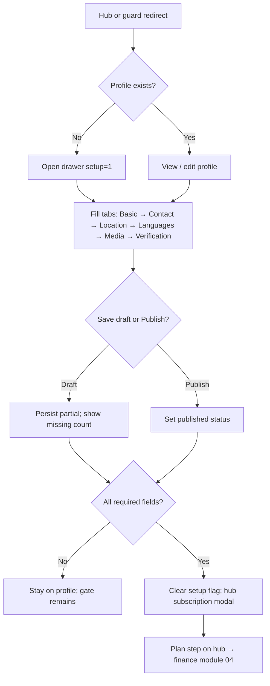

# Module 03 — Business Profile Complete

**Hub module:** Business profile complete  
**Route:** `/business/profile` (`?setup=1` opens drawer)  
**Previous:** [02-login.md](./02-login.md) · **Next:** [04-finance-settings.md](./04-finance-settings.md)

---

## 1. Business Context

After authentication, vendors must complete a **public business profile** before unlocking marketplace features. The profile captures entity type, contact, location, languages, media, and KYC. Profile can be saved as **draft** (partial) or **published**. Completeness is determined by required fields — not by verification status. When complete, the **subscription/plan step** runs on Temple Hub; then finance setup (module 04).

**In scope:** Profile CRUD, completeness gate, subscription prompt on hub.  
**Out of scope:** Service listings, bank accounts, payment checkout (beyond plan acknowledgment).

---

## 2. Business Objectives

| Objective | Success metric |
|-----------|----------------|
| Capture minimum viable business identity | 100% required fields before onboarding advances |
| Support incremental completion | Draft save without blocking partial data |
| Separate completeness from KYC | Onboarding gate ≠ admin verification |
| Drive plan selection | Profile complete → hub subscription modal |
| One profile per account | No duplicate business profiles |

---

## 3. Personas

| Persona | Goal | Pain point |
|---------|------|------------|
| **Individual vendor (Priya)** | Quick profile as sole proprietor | Too many company-only fields |
| **Company vendor (Rajesh)** | Legal entity + authorized contact | CIN/LLPIN and document uploads |
| **Returning user** | Finish draft later | Losing partial progress |

---

## 4. User Journey



| Step | User action | System response |
|------|-------------|-----------------|
| 1 | Land on profile (hub CTA or guard) | Open drawer if `?setup=1` |
| 2 | Select entity type | Show Individual or Company fields |
| 3 | Select business type | Category dropdown filters to subcategories |
| 4 | Enter pincode | Auto-fill city, district, state |
| 5 | Save draft | Persist; toast with missing count |
| 6 | Complete all required fields | Toast “Business profile complete” |
| 7 | Return to hub | Subscription modal if plan not chosen |

**Alternate paths:**
- Try create second profile → “Edit your existing profile instead”
- Invalid image URL → toast rejection
- Duplicate language → “This language is already added”

---

## 5. Screen Inventory

| Screen | Route | Entry | Exit |
|--------|-------|-------|------|
| Business profile | `/business/profile` | Hub modal, guard redirect | Hub on complete |
| Auto-open drawer | `/business/profile?setup=1` | Onboarding guard | Same |

**Layout:** App shell with profile view + slide-out drawer.

**Drawer tabs:** Basic → Contact → Location → Languages → Media → Verification

| Tab | Key fields |
|-----|------------|
| Basic (Individual) | Entity type, your name, trading name, service type, category, experience, about |
| Basic (Company) | Entity type, legal name, CIN/LLPIN, incorporation date, trading name, service type, category, about |
| Contact | Authorized contact, designation, mobile, WhatsApp, alt phone, landline, email, social links |
| Location | Address, pincode (lookup), city, district, state, map link |
| Languages | Multi-select (no duplicates) |
| Media | Logo, cover image, gallery |
| Verification | Aadhaar, PAN, GST, document uploads |

---

## 6. UI Requirements

### Required field validation (completeness)

| Field | Individual | Company | Empty check |
|-------|------------|---------|-------------|
| Entity type | Yes | Yes | Blank or unset |
| Business type | Yes | Yes | Blank |
| Category | Yes | Yes | Blank |
| Mobile | Yes | Yes | Blank |
| WhatsApp | Yes | Yes | Blank |
| Pincode | Yes | Yes | Blank |
| Address | Yes | Yes | Blank |
| City | Yes | Yes | Blank |
| State | Yes | Yes | Blank |
| About | Yes | Yes | Blank |
| Owner name | Yes | Yes | Blank |
| Legal company name | — | Yes | Blank |
| Company reg number | — | Yes | Blank |

**Completeness:** `missingRequiredFields.length === 0`

### Optional / format validations

| Field | Format / rule | Error message |
|-------|---------------|---------------|
| Mobile / WhatsApp | 10-digit Indian | — |
| Pincode | 6 digits | “No location found for this pincode” |
| Email | Valid email if provided | Standard format |
| PAN | `^[A-Z]{5}[0-9]{4}[A-Z]$` if provided | Invalid PAN format |
| GST | 15-char GSTIN if provided | Invalid GST format |
| Aadhaar | 12 digits if provided | — |
| Category | Valid subcategory of selected type | Blank or invalid |
| Logo / cover / gallery | Valid image URL or file | “Enter a valid image link” / “Could not read image file” |
| Languages[] | No duplicate | “This language is already added” |

### Save / publish behaviour

| Action | Validation | On success |
|--------|------------|------------|
| Save draft | None for required fields | “Profile saved” / “Profile created” |
| Save draft (complete) | Completeness check | “Business profile complete” + subscription hint |
| Publish | Should enforce completeness (API) | “Profile published” |

### Completeness feedback

| Missing count | Message |
|---------------|---------|
| &gt; 0 after save | “{n} required field(s) still needed” |
| 0 | “Business profile complete — Next: choose your plan on the hub” |

### Visual
- Drawer with 6 tabs and step indicator (“Step X of 6”)
- Required fields marked with red asterisk
- Company vs Individual toggles different basic tab fields
- Profile view shows completion % and missing field list
- Empty state CTA: “Start required setup” when mandatory onboarding

### Working hours (optional — defaults in model)

| Field | Default |
|-------|---------|
| `workingDays` | Mon–Sat |
| `openingTime` | 06:00 |
| `closingTime` | 20:00 |

Not required for profile completeness today.

---

## 7. Data Model

```typescript
type ProfileStatus = "draft" | "published" | "pending";
type EntityType = "individual" | "company";
type VerificationStatus =
  | "not_submitted" | "pending" | "verified" | "rejected" | "reupload_requested";

interface BusinessProfile {
  id: string;
  entityType: EntityType | "";
  businessName: string;
  businessType: string;
  category: string;
  about: string;
  ownerName: string;
  legalCompanyName: string;
  companyRegNumber: string;
  mobile: string;
  whatsapp: string;
  address: string;
  city: string;
  state: string;
  pincode: string;
  languages: string[];
  logo: string | null;
  coverImage: string | null;
  gallery: string[];
  status: ProfileStatus;
  verificationStatus: VerificationStatus;
  // KYC: aadhaar, pan, gst, documents
}
```

**Languages (allowed):** Kannada, English, Hindi, Telugu, Tamil, Malayalam, Marathi, Sanskrit.

**Business types (examples):** Priest/Archaka, Astrologer, Vastu, Caterer, Hotel/Lodge, Restaurant, Travel, Decorator, Musician, Photographer, Flower Vendor, Temple Service Vendor, Other — each with subcategory list.

---

## 8. Business Rules

| ID | Rule |
|----|------|
| BR-PROF-01 | Only **one** business profile per account |
| BR-PROF-02 | Entity type drives required fields: Individual vs Company |
| BR-PROF-03 | Completeness (onboarding gate) ≠ verification (admin KYC) |
| BR-PROF-04 | User can save **draft** anytime without all required fields |
| BR-PROF-05 | **Publish** sets published status; onboarding advances only when required fields complete |
| BR-PROF-06 | Mobile from registration **prefills** contact mobile |
| BR-PROF-07 | Pincode lookup auto-fills city, district, state |
| BR-PROF-08 | Languages: duplicate language not allowed |
| BR-PROF-09 | Media: valid URL or file upload; invalid URL rejected |
| BR-PROF-10 | Company profiles require legal name + registration number + authorized contact |
| BR-PROF-11 | Verification documents optional for draft |
| BR-PROF-12 | Profile complete → clear setup flag → subscription dialog on hub |
| BR-PROF-13 | `?setup=1` auto-opens create/edit drawer |
| BR-PROF-14 | User selects **business type** first |
| BR-PROF-15 | **Category** = subcategories of that type — not free text |
| BR-PROF-16 | Changing business type resets category if invalid |

### Required fields by entity type

**All types:** entity type, business type, category, mobile, WhatsApp, pincode, address, city, state, about.

**Individual adds:** owner name.

**Company adds:** legal company name, company registration number (CIN/LLPIN), authorized contact name.

**If entity type not selected:** only entity type required until chosen.

### Plan / subscription step (on Temple Hub — not a separate doc)

| ID | Rule |
|----|------|
| BR-SUB-01 | Trigger: profile complete + `subscriptionComplete` false |
| BR-SUB-02 | Hub modal: “Choose your plan” → `/temple/settings/upgrade` |
| BR-SUB-03 | Until plan complete: only profile, settings, finance unlocked |
| BR-SUB-04 | Checkout (prototype): mock Pay → `subscriptionComplete` → finance modal |
| BR-SUB-05 | Snooze: “Remind me later” — session only |

**Plans (target):** Trial ₹0, Basic ₹499/mo, Professional ₹1,499/mo, Premium ₹3,499/mo.

**Complete when:** Payment success or free plan → `markSubscriptionComplete()` → finance prompt (module 04).

---

## 9. Workflow States

| Profile status | Meaning | Customer-visible |
|----------------|---------|------------------|
| `draft` | Partial data saved | No |
| `published` | User published profile | Target: yes when verified |
| `pending` | Awaiting review | No |

| Verification status | Meaning |
|---------------------|---------|
| `not_submitted` | No KYC docs |
| `pending` | Under admin review |
| `verified` | Approved |
| `rejected` / `reupload_requested` | Action needed |

| Onboarding transition | Trigger |
|-----------------------|---------|
| `profile` → `subscription` | All required fields complete |
| `subscription` → `finance` | Plan complete (see BR-SUB) |

| Event | Side effect |
|-------|-------------|
| Profile complete | Clear profile setup required flag |
| Profile complete | Trigger subscription hub toast/dialog |
| Draft save | Persist; close drawer |
| Publish | Set published status |
| Guard: incomplete | Redirect to profile `?setup=1` |

---

## 10. API Requirements

### `GET /business/profile`
Returns profile + `missingRequiredFields[]` + `completionPercent`.

### `PUT /business/profile`
Partial update; returns updated missing fields list.

### `POST /business/profile/publish`
**Precondition:** `missingRequiredFields.length === 0`  
**Error:** `PROFILE_INCOMPLETE` 400 with field labels array.

### `POST /business/profile/documents`
Multipart upload → `{ url }`.

### `GET /geo/pincode/{pincode}`
Returns city, district, state.

---

## 11. Permissions

| Actor | View profile | Edit profile | Publish |
|-------|--------------|--------------|---------|
| Business user (own account) | Yes | Yes | When complete |
| Business user (gated) | Yes | Yes (forced setup) | When complete |
| Demo user (prototype) | Yes | Yes | Per prototype rules |
| Anonymous | No | No | No |

Route guard blocks other modules until profile complete (see module 02).

---

## 12. Notifications

| Event | Message |
|-------|---------|
| Draft saved | “Profile saved” / “Profile created” |
| Incomplete save | “{n} required field(s) still needed” |
| Complete | “Business profile complete — Next: choose your plan on the hub” |
| Published | “Profile published” |
| Duplicate profile attempt | “You already have a business profile. Edit your existing profile instead.” |
| Invalid image | “Enter a valid image link” |
| Duplicate language | “This language is already added” |
| Pincode fail | “No location found for this pincode” |
| Hub subscription modal | “Choose your plan” |

---

## 13. Reports

| Report | Purpose | Phase |
|--------|---------|-------|
| Profile completion rate | Onboarding funnel | v2 |
| Entity type distribution | Product analytics | v2 |
| KYC verification turnaround | Ops SLA | v2 |
| Drop-off by drawer tab | UX optimization | v2 |

Not required for v1 prototype.

---

## 14. Acceptance Criteria

**AC-PROF-01** — When all individual required fields filled, then profile marked complete and subscription step starts.  
**AC-PROF-02** — When company legal name + reg number + contact + base fields filled, then profile marked complete.  
**AC-PROF-03** — When I save draft with partial data, then data persists and missing count shown.  
**AC-PROF-04** — When I enter valid pincode, then city, district, state populate.  
**AC-PROF-05** — When profile exists and I try create again, then error to edit existing.  
**AC-PROF-06** — When profile complete, then hub shows subscription modal.

---

## 15. Test Scenarios

| ID | Scenario | Steps | Expected |
|----|----------|-------|----------|
| TS-PROF-01 | Individual happy path | Fill all individual required fields | Complete + subscription hint |
| TS-PROF-02 | Company happy path | Fill company-specific fields | Complete |
| TS-PROF-03 | Draft partial | Save with 3 of 10 fields | Draft persisted; missing count |
| TS-PROF-04 | Pincode autofill | Enter valid 6-digit pincode | City/state populated |
| TS-PROF-05 | Duplicate profile | Create when one exists | Error message |
| TS-PROF-06 | Business type change | Change type after category set | Category resets if invalid |
| TS-PROF-07 | Invalid image URL | Paste bad URL in gallery | Toast error |
| TS-PROF-08 | Guard redirect | Deep link to services with incomplete profile | Redirect `?setup=1` |
| TS-PROF-09 | Subscription trigger | Complete profile → hub | Plan modal shown |
| TS-PROF-10 | Publish incomplete (API) | Publish with missing fields | `PROFILE_INCOMPLETE` 400 |

**Open decisions:** Block publish until KYC verified? Hard vs soft subscription gate? Document upload required for company?
