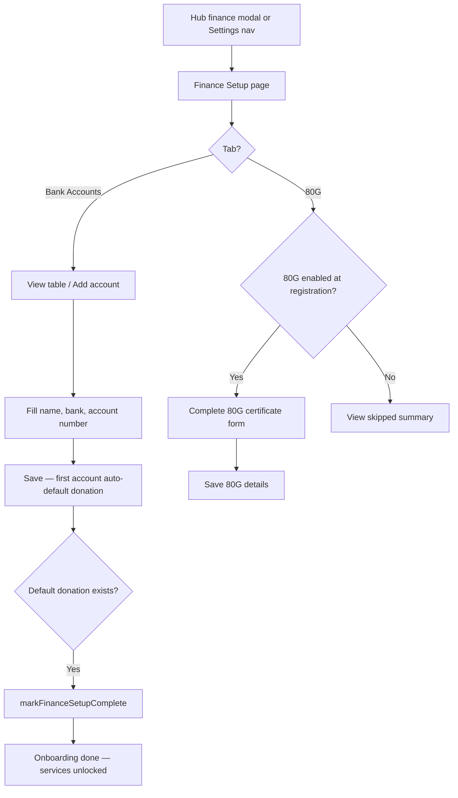

# Module 04 — Settings (Finance Settings)

**Hub module:** Settings → Finance settings  
**Route:** `/temple/settings/finance` (under Settings layout `/temple/settings`)  
**Previous:** [03-business-profile.md](./03-business-profile.md) · **Next:** [05-service-listing.md](./05-service-listing.md)

---

## 1. Business Context

After profile and plan steps, vendors configure **payout bank accounts** and optional **80G tax certificate** details. Finance onboarding completes when at least one bank account exists with a **default donation account**. This unlocks full hub access including service listings. 80G supports donor tax receipts — optional unless the user registered with 80G enabled.

**In scope:** Bank account CRUD, default donation/seva flags, 80G certificate form.  
**Out of scope:** Finance transactions, payouts ledger, gateway onboarding UI (link ID only).

---

## 2. Business Objectives

| Objective | Success metric |
|-----------|----------------|
| Enable donation payouts | Default donation account set before go-live |
| Minimize setup friction | First account auto-defaults donation |
| Support tax compliance | 80G details when user opted in at registration |
| Gate service listings | Finance complete = onboarding `done` |
| Prevent payout misrouting | Exactly one default donation at a time |

---

## 3. Personas

| Persona | Goal |
|---------|------|
| **Temple trust treasurer** | Configure donation + seva accounts with 80G |
| **SMB vendor (Priya)** | Single bank account for payouts; skip 80G |
| **Onboarding user** | Complete finance from hub modal CTA |

---

## 4. User Journey



| Step | User action | System response |
|------|-------------|-----------------|
| 1 | Open finance settings | Show Bank Accounts + 80G tabs |
| 2 | Add first bank account | Auto-set default donation |
| 3 | Add more accounts | Optional IFSC, purpose, gateway ID |
| 4 | Set default donation on B | Clear default on A |
| 5 | Complete 80G (if enabled) | Save registration, PAN, validity |
| 6 | Default donation confirmed | Finance complete flag; hub full access |

**Alternate paths:**
- Delete last account → “Keep at least one bank account”
- 80G enabled but missing fields → combined validation toast

---

## 5. Screen Inventory

| Screen | Route | Entry | Exit |
|--------|-------|-------|------|
| Finance Setup | `/temple/settings/finance` | Hub modal, Settings nav | Hub / Services when complete |
| Parent layout | `/temple/settings` | Settings shell | — |

**Tabs:** Bank Accounts | 80G Certificates

### Bank tab
- Table: account name, bank, masked number, defaults, status, actions
- Add / Edit dialog
- Link gateway account ID modal
- Warning banner when no default donation

### 80G tab
- Summary when complete or skipped
- Edit form when 80G enabled
- Download blank 80G template action

---

## 6. UI Requirements

### Bank account — add / edit

| Field | Required | Format / rule | Error message |
|-------|----------|---------------|---------------|
| Account name | Yes | Non-empty trim | “Please fill account name, bank name and account number” |
| Bank name | Yes | Non-empty trim | (same combined toast) |
| Account number | Yes | Non-empty trim | (same combined toast) |
| IFSC code | No | `^[A-Z]{4}0[A-Z0-9]{6}$` | Invalid IFSC |
| Branch | No | Free text | — |
| Purpose | No | From allowed tag list | — |
| PAN number | No | 10 characters if provided | — |
| 80G link | No | Non-80G, 80G, Both | Default Non-80G |
| Default donation | Conditional | ≥1 account must have true | Warning banner if none |
| Default seva | No | Only one true globally | Auto-clear others on set |
| Gateway account ID | No | Trimmed string | — |

### Bank account — delete

| Rule | Error message |
|------|---------------|
| Only one account exists | “Keep at least one bank account” |
| Deleting default donation (target) | Reassign default first or block delete |

### 80G certificate — save

| Field | Required when 80G enabled | Error message |
|-------|---------------------------|---------------|
| Registration 80G | Yes | “Enter registration number and 10-digit PAN” |
| PAN | Yes (exactly 10 chars) | (same) |
| Validity from | Yes | “Enter validity dates” |
| Validity to | Yes | “Enter validity dates” |
| Signatory | No | — |

### Onboarding completion check

```
financeComplete =
  bankAccounts.length >= 1
  AND exists(account WHERE isDefaultDonation = true)
```

### Visual
- Page title: “Finance Setup”
- Info alert: donations, 80G, accounting relationship
- Success state when `financeSetupComplete`
- 80G status label derived from validity dates

**Purpose tags:** Donations, Seva Payments, Event Payments, Salaries, General Expenses, Project Funds.

---

## 7. Data Model

```typescript
interface BankAccount {
  id: string;
  accountName: string;
  bankName: string;
  accountNumber: string;
  ifscCode: string;
  branch: string;
  purpose?: string;
  panNumber?: string;
  eightyGLink: "Non-80G" | "80G" | "Both";
  isDefaultDonation: boolean;
  isDefaultSeva: boolean;
  isPrimary: boolean;
  gatewayAccountId?: string;
  status: "Active" | "Paused";
}

interface TempleFinanceConfig {
  eightyGEnabled: boolean;
  registration80G: string;
  pan: string;
  validityFrom: string;  // YYYY-MM-DD
  validityTo: string;
  signatory: string;
  associatedBankAccountId: string | null;
}
```

---

## 8. Business Rules

| ID | Rule |
|----|------|
| BR-FIN-01 | At least **one bank account** before finance onboarding completes |
| BR-FIN-02 | Exactly **one default donation account** — marking new clears others |
| BR-FIN-03 | **First bank account** auto-becomes default donation if none selected |
| BR-FIN-04 | At most **one default seva account** |
| BR-FIN-05 | Cannot delete the **last remaining** bank account |
| BR-FIN-06 | Default donation routes online/UPI/bank donations |
| BR-FIN-07 | Finance complete when default donation exists |
| BR-FIN-08 | IFSC stored uppercase when provided |
| BR-FIN-09 | Gateway account ID optional per account |
| BR-FIN-10 | Bank status Active or Paused — paused should not receive new payouts (target) |
| BR-FIN-11 | 80G tab: if registered **with** 80G → show form; **without** → skippable |
| BR-FIN-12 | 80G when enabled: registration + 10-digit PAN + validity dates required |
| BR-FIN-13 | 80G PAN saved uppercase |
| BR-FIN-14 | Finance settings ≠ finance transactions module |
| BR-FIN-15 | During finance onboarding: restricted to hub, profile, settings, finance routes |
| BR-FIN-16 | Hub finance modal CTA → this page |
| BR-FIN-17 | **80G at registration:** Yes → 80G tab required; No → skippable |

### 80G registration choice

| `has80G` at registration | Finance 80G tab behaviour |
|--------------------------|---------------------------|
| `yes` | Show certificate form; must complete §6 validations |
| `no` | Show skipped summary; 80G toggle off |
| not set | Use existing temple config default |

### 80G link options (bank account level)

`Non-80G` | `80G` | `Both`

---

## 9. Workflow States

| Finance onboarding | Condition |
|--------------------|-----------|
| Incomplete | No bank accounts OR no default donation |
| Complete | ≥1 account AND default donation set |

| Onboarding transition | Trigger |
|-----------------------|---------|
| `finance` → `done` | `markFinanceSetupComplete()` |

| Bank account status | Meaning |
|---------------------|---------|
| `Active` | Receives payouts |
| `Paused` | No new payouts (target) |

| Event | Side effect |
|-------|-------------|
| Bank list changes | Persist accounts |
| Default donation set | `markFinanceSetupComplete()` |
| Finance complete | Clear finance setup prompt dismiss flag |
| 80G saved | Update temple config |
| Onboarding guard | Block non-allowed routes until finance complete |

---

## 10. API Requirements

### `GET /settings/finance/bank-accounts`
Returns accounts array + `financeSetupComplete` boolean.

### `POST /settings/finance/bank-accounts`
Creates account; enforces default donation exclusivity server-side.

### `PUT /settings/finance/bank-accounts/{id}`
Updates account; reassigns defaults if needed.

### `DELETE /settings/finance/bank-accounts/{id}`
**Errors:** `CANNOT_DELETE_LAST_ACCOUNT` 400, `CANNOT_DELETE_DEFAULT` 400.

### `PUT /settings/finance/80g`
Saves 80G config; validates per §6 when enabled.

### `POST /settings/finance/gateway/link`
Links `gatewayAccountId` to bank account.

---

## 11. Permissions

| Actor | View finance | Add/edit banks | Delete banks | 80G form |
|-------|--------------|----------------|--------------|----------|
| Business user (finance step) | Yes | Yes | Yes (not last) | If 80G enabled |
| Business user (done) | Yes | Yes | Yes (not last) | If 80G enabled |
| Business user (no plan) | No (guard) | — | — | — |
| Demo user (prototype) | Yes | Yes | Yes | Per prototype |

During finance onboarding step, only hub, profile, settings, finance routes allowed.

---

## 12. Notifications

| Event | Message |
|-------|---------|
| Bank saved | Success toast (implicit) |
| Delete last account | “Keep at least one bank account” |
| Missing bank fields | “Please fill account name, bank name and account number” |
| 80G saved | “80G details saved” |
| 80G validation fail | “Enter registration number and 10-digit PAN” / “Enter validity dates” |
| No default donation | Warning banner on bank tab |
| Hub finance modal | “Complete finance setup” → CTA to this page |
| Finance complete | Hub unlocks service listings |

---

## 13. Reports

| Report | Purpose | Phase |
|--------|---------|-------|
| Finance setup completion rate | Onboarding funnel | v2 |
| Accounts per business | Ops | v2 |
| 80G certificate expiry alerts | Compliance | v2 |
| Default donation reassignment log | Audit | v2 |

Not required for v1 prototype.

---

## 14. Acceptance Criteria

**AC-FIN-01** — When I add account name, bank name, account number, then account saved as Active and auto-default donation.  
**AC-FIN-02** — When I set account B as default donation, then account A loses default flag.  
**AC-FIN-03** — When only one account exists and I delete, then error “Keep at least one bank account”.  
**AC-FIN-04** — When default donation exists, then finance setup complete and service listings accessible.  
**AC-FIN-05** — When 80G enabled and all required fields valid, then config saved with toast “80G details saved”.

---

## 15. Test Scenarios

| ID | Scenario | Expected |
|----|----------|----------|
| TS-FIN-01 | Add first bank account | Auto default donation; finance may complete |
| TS-FIN-02 | Switch default donation | Only one default at a time |
| TS-FIN-03 | Delete last account | Blocked with error |
| TS-FIN-04 | Invalid IFSC | Validation error / uppercase normalize |
| TS-FIN-05 | 80G enabled — missing PAN | Combined validation toast |
| TS-FIN-06 | 80G disabled at registration | Skipped summary shown |
| TS-FIN-07 | Finance incomplete + deep link services | Guard redirect to hub |
| TS-FIN-08 | Hub finance modal CTA | Opens `/temple/settings/finance` |
| TS-FIN-09 | Finance complete | Onboarding `done`; services unlocked |

**Open decisions:** Penny-drop verification? 80G required for SMB? Mask account number except last 4? Block delete of default without reassignment?
