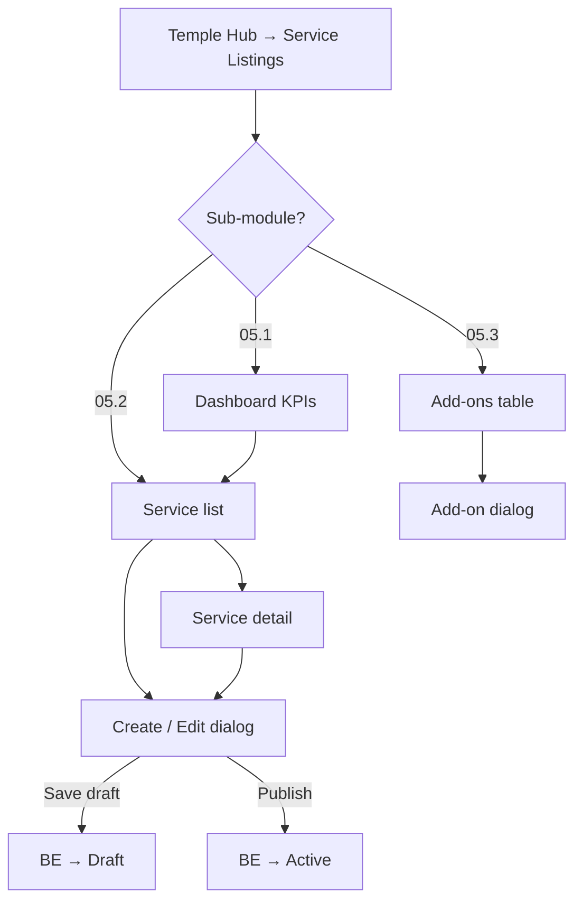

# Module 05 — Service Listings

**Hub module:** Service Listings  
**Base route:** `/business-connect/services`  
**Previous:** [04-finance-settings.md](./04-finance-settings.md) · **Next:** — (onboarding complete)

---

## Module map

```
Module 05 — Service Listings
│
├── 05.1 Dashboard                    /business-connect/services
├── 05.2 Service listing
│   ├── 05.2a List                    /business-connect/services/list
│   ├── 05.2b Create / Edit           (dialog on list & detail)
│   └── 05.2c Detail                  /business-connect/services/:serviceId
└── 05.3 Add-ons                      /business-connect/services/addons
```

| Sub-module | Nav label | Route | v1 scope |
|------------|-----------|-------|----------|
| 05.1 Dashboard | Dashboard | `/business-connect/services` | KPIs, charts, draft highlights |
| 05.2 Service listing | Service listing | `/business-connect/services/list` + `:id` | CRUD, draft/publish, bulk actions |
| 05.3 Add-ons | Add-ons | `/business-connect/services/addons` | Optional extras per main service |

**Future (routes exist, not in nav v1):** `availability`, `pricing`, `packages` → redirected or placeholder.

**Shared across sub-modules:** onboarding gate, `BusinessService` entity, status owned by backend (see §8 BR-SVC-04, BR-SVC-18).

---

## 1. Business Context

With onboarding complete, business users manage their **service catalogue** inside the Service Listings hub area. The parent module groups three nav sub-modules: **Dashboard** (overview), **Service listing** (core CRUD), and **Add-ons** (optional extras linked to a main service).

**Status ownership:** `Draft`, `Active`, and `Inactive` are **assigned and changed by the backend only**. The UI triggers actions (Save draft, Publish, Batch publish) and **displays** `status` from API responses. The UI must **not** send `status` in create/update request bodies.

**In scope (v1):** Sub-modules 05.1–05.3 as above.  
**Out of scope (v1 UI):** Availability calendar, standalone pricing page, packages (merged into list), inline add-ons in service form.

---

## 2. Business Objectives

| Objective | Sub-module | Success metric |
|-----------|------------|----------------|
| Catalogue visibility | 05.1 Dashboard | KPIs and draft backlog visible at a glance |
| Fast catalog creation | 05.2 Service listing | Draft with name only |
| Quality published listings | 05.2 Service listing | BE publish validation on category, description, pricing |
| Manage at scale | 05.2a List | Search, filter, bulk delete/publish |
| Extend offerings | 05.3 Add-ons | Add-ons linked to main services |
| Indian market pricing | 05.2, 05.3 | Rupee format validation |

---

## 3. Personas

| Persona | Primary sub-module | Goal |
|---------|-------------------|------|
| **Priest vendor** | 05.2 Service listing | List puja services with fixed pricing |
| **Caterer** | 05.2 Service listing | Per-plate pricing with gallery |
| **Hotel operator** | 05.2 Service listing | “Starting from” nightly rates |
| **Catalog manager** | 05.1 + 05.2a | Monitor drafts; bulk publish |
| **Upsell-focused vendor** | 05.3 Add-ons | Attach optional extras to main services |

---

## 4. User Journey



| Step | Sub-module | User action | System response |
|------|------------|-------------|-----------------|
| 1 | 05.1 | Open dashboard | Stats widgets + charts |
| 2 | 05.2a | Open service list | Table or card grid |
| 3 | 05.2b | Create service | Restore browser draft if exists |
| 4 | 05.2b | Save draft | API saves content; **BE** returns `status: Draft` |
| 5 | 05.2b | Publish | `POST …/publish`; **BE** sets `status: Active` |
| 6 | 05.2c | Row click | Navigate to detail |
| 7 | 05.3 | Manage add-ons | Filter by main service; CRUD add-ons |

---

## 5. Screen Inventory

### Parent layout

| Item | Detail |
|------|--------|
| Shell | `TempleLayout` — title “Service Listings”, left nav: Dashboard · Service listing · Add-ons |
| Base route | `/business-connect/services` |

### By sub-module

| ID | Screen | Route | Entry | Exit |
|----|--------|-------|-------|------|
| 05.1 | Dashboard | `/business-connect/services` | Hub tile, nav | List, Add-ons |
| 05.2a | Service list | `/business-connect/services/list` | Nav, dashboard CTA | Detail, dialog |
| 05.2b | Create / Edit dialog | Modal on 05.2a / 05.2c | Create, Edit | Close → list or detail |
| 05.2c | Service detail | `/business-connect/services/:serviceId` | Row click, View | Back → list |
| 05.3 | Add-ons list | `/business-connect/services/addons` | Nav; `?serviceId=` pre-filter | Add-on dialog |

---

# Sub-module 05.1 — Dashboard

## 05.1 · 1. Business Context

Read-only overview of the service catalogue: counts, trends, category distribution, and pending drafts. Entry point after opening Service Listings from hub; does not mutate data.

## 05.1 · 5. Screen Inventory

| Screen | Route | Components |
|--------|-------|------------|
| Dashboard | `/business-connect/services` | `ServiceStatsWidgets`, `ServiceDashboardCharts` |

## 05.1 · 6. UI Requirements

| Widget / area | Content |
|---------------|---------|
| Stats | Total services, Active, Draft (pending publish), views, enquiries |
| Draft highlight | Count + link to filter drafts on list |
| Charts | Category distribution, status breakdown (target) |

Eyebrow: “Business Connect · Services”. No forms; no status changes.

## 05.1 · 8. Business Rules

| ID | Rule |
|----|------|
| BR-DASH-01 | Read-only — no create/edit/delete on dashboard |
| BR-DASH-02 | Draft count drives “pending publish” CTA → navigates to 05.2a with draft filter |
| BR-DASH-03 | Data sourced from same `GET /services` aggregate / stats endpoint |

## 05.1 · 10. API Requirements

### `GET /services/stats` (target)
```json
{
  "total": 12,
  "active": 8,
  "draft": 3,
  "inactive": 1,
  "views": 420,
  "enquiries": 18,
  "byCategory": [{ "category": "Catering", "count": 4 }]
}
```

**Prototype:** computed client-side from local store.

## 05.1 · 13. Reports

Dashboard is the v1 reports surface. Export / date-range filters → v2.

---

# Sub-module 05.2 — Service listing

Covers **05.2a List**, **05.2b Create / Edit**, and **05.2c Detail**.

## 05.2 · 1. Business Context

Core catalogue management: list services, create/edit via tabbed dialog, view detail, draft/publish workflow. Status transitions are backend-owned.

## 05.2a · 5. Screen Inventory — List

| Feature | Detail |
|---------|--------|
| Route | `/business-connect/services/list` |
| Views | Table (default), card grid toggle |
| Filters | Search, category, status (`?status=` → BE) |
| Bulk actions | Delete selected, batch publish (drafts only) |
| Empty state | Create CTA when no services |

**Table columns:** ID, Service (name + description stacked), Category, Price, Status, Updated.

## 05.2b · 5. Screen Inventory — Create / Edit dialog

| Tab | Fields |
|-----|--------|
| Information | Name*, category*, description*, cover image, gallery |
| Pricing | Pricing type*, price, discount |
| Custom fields | Dynamic builder |

\*Required on publish (BE validation). Dialog actions: Back / Next / Save Draft / Publish.

**v1 form scope:** name, category, description, image, gallery, pricingType, price, discount, customFields.

**Not in v1 form (model defaults):** serviceType, duration, coverage, booking, availability, slots, videoLinks, requirements.

## 05.2c · 5. Screen Inventory — Detail

| Feature | Detail |
|---------|--------|
| Route | `/business-connect/services/:serviceId` |
| Actions | View all fields, Edit (opens 05.2b), Delete with confirm |
| Back | → `/business-connect/services/list` |

## 05.2 · 6. UI Requirements

### UI actions vs backend status

| UI button | API call | Who sets `status` |
|-----------|----------|-------------------|
| Save Draft | `POST /services` or `PUT /services/{id}` (content only) | **Backend** → `Draft` |
| Publish | `POST /services/{id}/publish` | **Backend** → `Active` |
| Batch publish | `POST /services/bulk-activate` | **Backend** → `Active` per id |
| Delist (target) | `POST /services/{id}/deactivate` | **Backend** → `Inactive` |

UI may run **client-side pre-validation** before publish. Authoritative validation and status transition remain on the backend. UI must not send `status` in create/update payloads.

### Draft mode (`mode: draft` — client pre-check)

| Field | Required | Error message |
|-------|----------|---------------|
| Name | Yes | “Service name is required” |

### Publish mode (`mode: publish` — client pre-check before `POST …/publish`)

**Information tab**

| Field | Required | Error message |
|-------|----------|---------------|
| Name | Yes | “Service name is required” |
| Category | Yes | “Select a category” |
| Description | Yes | “Short description is required” |
| Cover image | No | “Enter a valid cover image link” |
| Gallery[] | No | “One or more gallery links are invalid” |

**Pricing tab**

| Field | Required | Error message |
|-------|----------|---------------|
| Pricing type | Yes | — |
| Price | When Fixed / Starting From | “Enter price in rupees (e.g. ₹5,000)” |
| Price format | When provided | “Use rupee format: ₹5,000 or ₹250 per plate” |
| Discount | No | “Use 10% or rupee format: ₹500” |

**Pricing needs amount when:** Fixed Price or Starting From.

### Rupee format rules

- `₹5,000` / `₹5000` / `Rs. 5000` / `INR 5000`; optional suffix `₹250 per plate`
- Discount: `10%`, `10.5%`, or rupee rules

### List / filter (05.2a)

| Control | Rule |
|---------|------|
| Search | Case-insensitive on name, category, description |
| Category filter | `all` or exact match |
| Status filter | `all`, Draft, Active, Inactive — BE query param |
| Pagination | Reset to page 1 on filter change |
| Row click | → 05.2c Detail |
| Checkbox | Selection for bulk; no conflict with row click |

**Categories:** Priest Service, Catering, Hotel & Accommodation, Travel & Transport, Astrology, Vastu, Decoration, Photography, Music Services, Other.

### Browser draft (05.2b)

Unsaved create dialog restored from `localStorage` on reopen; cleared on successful API save.

## 05.2 · 8. Business Rules

| ID | Rule | Applies to |
|----|------|------------|
| BR-SVC-01 | Full onboarding required | All 05.x |
| BR-SVC-02 | Draft save requires only service name | 05.2b |
| BR-SVC-03 | Publish requires information + pricing rules | 05.2b |
| BR-SVC-04 | **Backend** assigns status | 05.2a–c |
| BR-SVC-18 | UI must **not** send `status` in bodies | 05.2a–c |
| BR-SVC-05 | Pricing type drives amount requirement | 05.2b |
| BR-SVC-06 | Rupee format for price/discount | 05.2b |
| BR-SVC-07 | Cover/gallery optional for draft | 05.2b |
| BR-SVC-08 | Custom fields optional | 05.2b |
| BR-SVC-09 | Browser draft restore on reopen create | 05.2b |
| BR-SVC-10 | Row click → detail; checkbox → select | 05.2a |
| BR-SVC-11 | Single select → Edit + Delete | 05.2a |
| BR-SVC-12 | Multi select → Delete (n), batch publish drafts | 05.2a |
| BR-SVC-13–16 | Search, filters, pagination, empty state | 05.2a |
| BR-SVC-17 | Inactive delists without delete | 05.2a–c |

### Pricing type matrix

| Pricing type | Price required on publish | Discount allowed |
|--------------|---------------------------|------------------|
| Fixed Price | Yes | Yes |
| Starting From | Yes | Yes |
| Contact For Pricing | No | No |
| Quote Based | No | No |

## 05.2 · 9. Workflow States

| Service status | Set by | Sub-module |
|----------------|--------|------------|
| `Draft` | BE on create / draft save | 05.2b |
| `Active` | BE on publish / bulk-activate | 05.2a, 05.2b |
| `Inactive` | BE on deactivate (target) | 05.2a, 05.2c |

## 05.2 · 10. API Requirements

| Endpoint | Sub-module | Notes |
|----------|------------|-------|
| `GET /services?…` | 05.2a | Paginated list; `status` filter server-side |
| `POST /services` | 05.2b | Content only; BE → `Draft` |
| `PUT /services/{id}` | 05.2b, 05.2c | Content only; BE preserves status |
| `GET /services/{id}` | 05.2c | Full service |
| `POST /services/{id}/publish` | 05.2b | BE validates → `Active` |
| `POST /services/{id}/deactivate` | 05.2c | BE → `Inactive` (target) |
| `DELETE /services/{id}` | 05.2a, 05.2c | Remove record |
| `POST /services/bulk-delete` | 05.2a | `{ ids: [] }` |
| `POST /services/bulk-activate` | 05.2a | BE publishes drafts |

---

# Sub-module 05.3 — Add-ons

## 05.3 · 1. Business Context

Optional extras or customizable options **linked to one main service** (e.g. extra prasad plate, decoration tier). Managed on a dedicated list page; not inline in the service form (v1).

## 05.3 · 5. Screen Inventory

| Screen | Route | Purpose |
|--------|-------|---------|
| Add-ons list | `/business-connect/services/addons` | Table with search + service filter |
| Add-on dialog | Modal | Create / edit add-on |
| View dialog | Modal | Read-only detail |

**Query param:** `?serviceId=` pre-selects main service filter and dialog default.

**Table columns:** ID, Add-on (name + description), Main service, Price, Linked services, Updated.

## 05.3 · 6. UI Requirements

| Field | Required | Error message |
|-------|----------|---------------|
| Main service | Yes | “Service is required” |
| Name | Yes | “Add-on name is required” |
| Description | No | — |
| Pricing type | No | Defaults to Fixed Price |
| Price | If Fixed / Starting From | “Enter price in rupees (e.g. ₹500)” |
| Linked services | No | Multi-select other services |

Search: name, description. Filter: by main service (`all` or specific id).

## 05.3 · 8. Business Rules

| ID | Rule |
|----|------|
| BR-ADD-01 | Each add-on belongs to exactly one **main service** |
| BR-ADD-02 | Name required; price required unless Contact For Pricing |
| BR-ADD-03 | Optional **linked services** for combined pricing display |
| BR-ADD-04 | At least one **Active** main service should exist before add-on is customer-visible (target) |
| BR-ADD-05 | Deleting main service cascades or blocks add-ons (target — open) |

## 05.3 · 10. API Requirements

| Endpoint | Notes |
|----------|-------|
| `GET /services/{serviceId}/addons` | List add-ons for a service |
| `GET /addons?serviceId&search` | Global add-ons list (05.3 table) |
| `POST /services/{serviceId}/addons` | Create; body excludes status if add-ons gain lifecycle later |
| `PUT /addons/{id}` | Update |
| `DELETE /addons/{id}` | Remove |

**Prototype:** add-ons nested under service in local store (`service.addOns[]`).

---

## 7. Data Model (shared)

```typescript
type ServiceStatus = "Draft" | "Active" | "Inactive";
type PricingType = "Fixed Price" | "Starting From" | "Contact For Pricing" | "Quote Based";

interface BusinessService {
  id: string;
  name: string;
  category: string;
  description: string;
  image?: string;
  gallery: string[];
  pricingType: PricingType;
  price?: string;
  discount?: string;
  status: ServiceStatus;  // read-only in UI — BE on create/publish/deactivate
  updatedAt: string;
  views: number;
  enquiries: number;
  customFields?: ServiceCustomField[];
  addOns?: ServiceAddOn[];  // 05.3; separate API in production
}

interface ServiceCustomField {
  id: string;
  name: string;
  type: "Text" | "Number" | "Date" | "Dropdown" | "Multi Select" | "Checkbox" | "Text Area";
  required: boolean;
  options?: string[];
}

interface ServiceAddOn {
  id: string;
  mainServiceId: string;  // or serviceId
  name: string;
  description?: string;
  price?: string;
  pricingType?: PricingType;
  linkedServiceIds?: string[];
}
```

---

## 8. Business Rules (parent)

| ID | Rule |
|----|------|
| BR-SL-01 | Service Listings hub requires onboarding `done` (modules 02, 04) |
| BR-SL-02 | Nav order: Dashboard → Service listing → Add-ons |
| BR-SL-03 | Service listing nav active for both `/list` and `/:serviceId` (non-reserved paths) |
| BR-SL-04 | Reserved path segments: `list`, `addons`, `packages`, `availability`, `pricing` |

Sub-module rules: **BR-DASH-***, **BR-SVC-***, **BR-ADD-*** above.

---

## 9. Workflow States (parent)

| Area | State owner | Notes |
|------|-------------|-------|
| Service `status` | Backend | 05.2 only |
| Browser create draft | UI `localStorage` | 05.2b only; not server status |
| Add-ons | No lifecycle status in v1 | 05.3 |

---

## 10. API Requirements (parent)

**Status rule:** Create/update bodies **exclude** `status`. See 05.2 · 10 and 05.3 · 10 for sub-module endpoints.

### Validation error shape (target)
```json
{
  "code": "VALIDATION_ERROR",
  "errors": {
    "name": "Service name is required",
    "price": "Enter price in rupees (e.g. ₹5,000)"
  }
}
```

---

## 11. Permissions

| Actor | 05.1 Dashboard | 05.2 Service listing | 05.3 Add-ons |
|-------|----------------|----------------------|--------------|
| Business user (onboarding done) | View | Full CRUD + publish | Full CRUD |
| Business user (gated) | No | No | No |
| Demo user (prototype) | View | Full | Full |
| Anonymous | No | No | No |

---

## 12. Notifications

| Event | Sub-module | Message |
|-------|------------|---------|
| Draft saved | 05.2b | “Draft saved” |
| Published | 05.2b | “Service published” |
| Draft restored | 05.2b | Info toast on reopen create |
| Validation errors | 05.2b | Inline + tab jump |
| Bulk delete confirm | 05.2a | Confirmation dialog |
| Add-on saved | 05.3 | Success toast |
| Add-on validation | 05.3 | “Service is required” / “Add-on name is required” |

---

## 13. Reports

| Report | Sub-module | Phase |
|--------|------------|-------|
| KPI dashboard | 05.1 | v1 (widgets) |
| Active services per vendor | 05.2 | v2 |
| Draft → Active conversion | 05.2 | v2 |
| Views / enquiries per service | 05.2 | v2 |
| Add-ons per service | 05.3 | v2 |

---

## 14. Acceptance Criteria

### 05.1 Dashboard
**AC-DASH-01** — Dashboard shows draft count matching list filter.

### 05.2 Service listing
**AC-SVC-01** — Save draft with name → API returns `status: Draft`.  
**AC-SVC-02** — Publish without category → BE validation error.  
**AC-SVC-03** — Contact For Pricing publish without price → `status: Active`.  
**AC-SVC-04** — Fixed Price without price → BE price error.  
**AC-SVC-05** — Bulk delete 3 rows → confirm → removed.  
**AC-SVC-06** — Row click opens detail; checkbox selects for bulk.

### 05.3 Add-ons
**AC-ADD-01** — Create add-on without main service → “Service is required”.  
**AC-ADD-02** — `?serviceId=` opens add-ons with service pre-selected.

---

## 15. Test Scenarios

| ID | Sub-module | Scenario | Expected |
|----|------------|----------|----------|
| TS-DASH-01 | 05.1 | Open dashboard | Widgets render |
| TS-DASH-02 | 05.1 | Click draft CTA | Navigates to list with draft filter |
| TS-SVC-01 | 05.2b | Draft name only | API `status: Draft` |
| TS-SVC-02 | 05.2b | Publish missing category | BE `VALIDATION_ERROR` |
| TS-SVC-03 | 05.2b | PUT with `status` in body | BE ignores/rejects |
| TS-SVC-04 | 05.2a | Batch publish drafts | BE sets Active per id |
| TS-SVC-05 | 05.2c | Edit from detail | Same dialog as list |
| TS-SVC-06 | 05.2a | Row vs checkbox | Detail vs selection |
| TS-ADD-01 | 05.3 | Missing main service | Validation error |
| TS-ADD-02 | 05.3 | Filter by service | Table filtered |
| TS-ADD-03 | 05.3 | Linked services | Saved on add-on |
| TS-SL-01 | Parent | Gated user deep link | Redirect per guard |
| TS-SL-02 | Parent | Nav highlights | List active on detail route |

**Open decisions:** File upload vs URL-only? Admin approval before Active? Cascade delete add-ons with service? Availability/pricing as future sub-modules?
