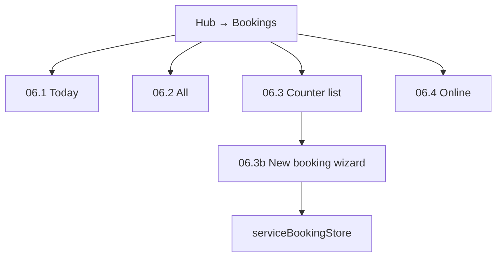

# Module 06 — Booking Management

**Hub module:** Booking Management  
**Hub route:** `/business-connect/bookings`  
**Previous:** [05-service-listing.md](./05-service-listing.md) · **Next:** [07-crm.md](./07-crm.md)

**Implementation:** Business SMB booking UI (`src/pages/business/bookings/*`) with `serviceBookingStore` — **not** temple seva/devotee flows.

---

## Module map

```
Module 06 — Booking Management
│
├── 06.1 Today                        /business-connect/bookings
├── 06.2 All Bookings                 /business-connect/bookings/all  (counter + online)
├── 06.3 Counter Booking              /business-connect/bookings/counter  (temple-style wizard, SMB fields)
└── 06.5 Calendar                     /business-connect/bookings/calendar
```

| Sub-module | Nav label | Route |
|------------|-----------|-------|
| 06.1 | Today | `/business-connect/bookings` |
| 06.2 | All Bookings | `/business-connect/bookings/all` — includes **Online** via source filter |
| 06.3 | Counter Booking | `/business-connect/bookings/counter` — cart wizard (temple layout) |
| 06.5 | Calendar | `/business-connect/bookings/calendar` |

**Removed:** Prasad Counter, Attendance, separate Online nav (`/online` → redirects to All).

**Temple admin** (`/temple/bookings`) keeps temple-specific UI separately.

---

## Field mapping (temple → business SMB)

| Temple (removed from hub) | Business SMB |
|---------------------------|--------------|
| Devotee | **Customer** (`customerName`, `customerPhone`) |
| Offering / Seva | **Service** (`serviceName`, `serviceId`) |
| Structure / Shrine | **Location** (`serviceDetails.location`, address) |
| Gothram, Nakshatra, Sankalpam | — (not used) |
| Priest | — (optional notes) |
| Ritual / Darshan type | **Service category** (Catering, Priest Services, Hotel, …) |
| Prasadam | — (removed) |

### Customer fields (counter wizard)

| Field | Required |
|-------|----------|
| Phone | Yes (lookup / create customer) |
| Name | Yes |
| Pincode | Optional (auto city/state) |
| Email, PAN | Optional |
| Booking purpose | Optional (Housewarming, Wedding, Corporate, …) |

### Service booking entity

See `ServiceBooking` in `src/types/serviceBooking.ts` — status **backend-owned** in production.

---

## 1. Business Context

SMB vendors manage **service bookings** from counter and online channels after catalogue setup. Counter staff create bookings against **Active** services/packages; ops views today’s schedule and full history.

---

## 2. Business Objectives

| Objective | Sub-module |
|-----------|------------|
| Same-day visibility | 06.1 Today |
| Full history | 06.2 All |
| Walk-in / phone sales | 06.3 Counter |
| Marketplace orders | 06.4 Online |
| Schedule overview | 06.5 Calendar |

---

## 3. Personas

| Persona | Sub-module |
|---------|------------|
| Counter staff | 06.3 |
| Ops / owner | 06.1, 06.2 |
| Online channel monitor | 06.4 |

---

## 4. User Journey



---

## 5. Screen Inventory

| ID | Screen | Component |
|----|--------|-----------|
| 06.1 | Today | `BusinessBookingsToday.tsx` |
| 06.2 | All | `BusinessAllBookings.tsx` |
| 06.3 | Counter list | `CounterBookingsPage.tsx` |
| 06.3b | New booking | `NewCounterBookingPage.tsx` |
| 06.4 | Online | `OnlineBookings.tsx` |
| 06.5 | Calendar | `BookingCalendarPage.tsx` |

---

## 6. UI Requirements

### 06.3b Counter wizard steps

1. **What to book?** — Select service or package, date, time slot  
2. **Customer details** — Phone, name, address, purpose  
3. **Payment** — Cash, UPI, Card, Bank Transfer  

### 06.1 Today table columns

Time · Service · Category · Customer · Source · Amount · Payment · Status

### Booking statuses (display from BE)

`Enquiry` · `Quotation Sent` · `Confirmed` · `In Progress` · `Completed` · `Cancelled`

---

## 7. Data Model

```typescript
interface ServiceBooking {
  id: string;
  serviceId: string;
  serviceName: string;
  category: string;
  customerName: string;
  customerPhone: string;
  customerEmail?: string;
  customerAddress?: string;
  customerCity?: string;
  customerState?: string;
  customerPincode?: string;
  customerPan?: string;
  bookingPurpose?: string;
  scheduledDate: string;
  scheduledTime: string;
  serviceDetails?: ServiceBookingDetails;
  amount: number;
  source: "Online" | "Counter";
  paymentStatus?: "Pending" | "Partial" | "Paid";
  status: ServiceBookingStatus;  // BE-owned
  createdAt: string;
}
```

---

## 8. Business Rules

| ID | Rule |
|----|------|
| BR-BKG-01 | Onboarding complete before hub access |
| BR-BKG-02 | Counter books against **Active** services/packages only |
| BR-BKG-03 | **Status** assigned by backend — UI does not send status on create |
| BR-BKG-04 | Customer matched/created by phone on counter flow |
| BR-BKG-05 | No prasad / attendance sub-modules in business hub |
| BR-BKG-06 | Category-specific service details (guest count, rooms, etc.) per `getServiceDetailFields` |

---

## 9–15. Workflow, API, Permissions, Notifications, Reports, AC, Tests

See parent patterns in modules 01–05. Key acceptance criteria:

**AC-BKG-01** — Today shows bookings where `scheduledDate` = today.  
**AC-BKG-02** — Counter wizard uses Customer (not Devotee) labels.  
**AC-BKG-03** — `/bookings/prasad` and `/bookings/attendance` redirect away.  
**AC-BKG-04** — New booking appears in All and Today when scheduled today.
