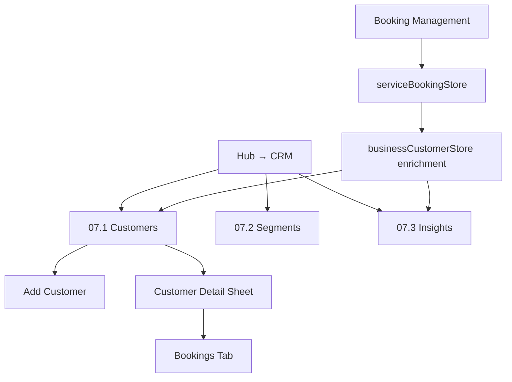

# Module 07 — CRM

**Hub module:** CRM  
**Hub route:** `/business-connect/crm`  
**Previous:** [06-bookings.md](./06-bookings.md) · **Next:** [08-communication.md](./08-communication.md)

**Implementation:** Business SMB CRM UI (`src/pages/business/crm/*`) with `businessCustomerStore` and booking enrichment from `serviceBookingStore` — **not** temple devotee CRM.

---

## Module map

```
Module 07 — CRM
│
├── 07.1 Customers                    /business-connect/crm
├── 07.2 Segments                     /business-connect/crm/segments
└── 07.3 Insights                     /business-connect/crm/insights
```

| Sub-module | Nav label | Route |
|------------|-----------|-------|
| 07.1 | Customers | `/business-connect/crm` |
| 07.2 | Segments | `/business-connect/crm/segments` |
| 07.3 | Insights | `/business-connect/crm/insights` |

**Temple admin** (`/temple/devotees`) keeps devotee-specific CRM separately.

---

## Field mapping (temple/devotee → business SMB)

| Temple / devotee CRM | Business SMB CRM |
|----------------------|------------------|
| Devotee | **Customer** (`name`, `phone`) |
| Gotra, nakshatra, family ritual data | — (not used) |
| Donation history | **Lifetime spend** from service bookings |
| Seva history | **Booking history** from `ServiceBooking` |
| Devotee group | **Customer tags / segments** |
| Donor tier | **Premium tier** (`Platinum`, `Gold`, `Silver`) |

---

## 1. Business Context

SMB vendors need a single customer record across counter bookings, online bookings, marketplace leads, referrals, and WhatsApp enquiries. CRM keeps customer identity, booking history, value, tags, communication logs, and lightweight segmentation for follow-ups.

---

## 2. Business Objectives

| Objective | Sub-module |
|-----------|------------|
| Maintain customer records | 07.1 Customers |
| Link booking history to customer profile | 07.1 Customers |
| Identify leads, active customers, premium customers | 07.1, 07.3 |
| Group customers for campaigns and follow-ups | 07.2 Segments |
| Track customer growth, source mix, revenue contribution | 07.3 Insights |

---

## 3. Personas

| Persona | Sub-module |
|---------|------------|
| Counter staff | 07.1 |
| Owner / operations lead | 07.1, 07.3 |
| Marketing / follow-up staff | 07.2 |

---

## 4. User Journey



---

## 5. Screen Inventory

| ID | Screen | Component |
|----|--------|-----------|
| 07.1 | Customers list | `CustomersList.tsx` |
| 07.1a | Add customer dialog | `AddCustomerDialog.tsx` |
| 07.1b | Customer detail sheet | `CustomerDetailSheet.tsx` |
| 07.2 | Segments | `CrmSegments.tsx` |
| 07.3 | Insights | `CrmInsights.tsx` |

---

## 6. UI Requirements

### 07.1 Customers table columns

ID · Customer · Company · Location · Tags · Bookings · Lifetime Spend · Last Booking · Status · Source

### 07.1 Filters and actions

| Control | Behavior |
|---------|----------|
| Search | Matches name, phone, email, company, customer ID |
| Tag filter | Filters by tag (`Premium`, `Repeat`, `New Lead`, `Corporate`, `High Value`, `Wedding`) |
| Status filter | Filters `Active`, `Lead`, `Inactive` |
| Source filter | Filters `Counter`, `Online`, `Referral`, `Marketplace`, `WhatsApp` |
| Add Customer | Opens dialog; requires name and phone |

### 07.1b Customer detail tabs

Overview · Bookings · Reviews · Comm Logs

### 07.2 Segments table columns

ID · Segment · Type · Criteria · Members · Last Campaign

### Customer statuses

`Active` · `Lead` · `Inactive`

### Customer sources

`Counter` · `Online` · `Referral` · `Marketplace` · `WhatsApp`

---

## 7. Data Model

```typescript
interface BusinessCustomer {
  id: string;
  name: string;
  phone: string;
  email?: string;
  companyName?: string;
  customerType: "Individual" | "Corporate";
  city?: string;
  state?: string;
  pincode?: string;
  address?: string;
  pan?: string;
  gstin?: string;
  preferredLanguage?: string;
  tags: string[];
  source: "Counter" | "Online" | "Referral" | "Marketplace" | "WhatsApp" | string;
  status: "Active" | "Inactive" | "Lead";
  notes?: string;
  totalBookings: number;
  lifetimeSpend: number;
  lastBookingDate?: string;
  createdAt: string;
  isPremium?: boolean;
  premiumTier?: "Platinum" | "Gold" | "Silver";
  commLogs?: CustomerCommLog[];
  reviews?: CustomerReview[];
}
```

`businessCustomerStore` enriches seeded/manual customers with `ServiceBooking` totals by normalized phone number.

---

## 8. Business Rules

| ID | Rule |
|----|------|
| BR-CRM-01 | Onboarding complete before CRM hub access |
| BR-CRM-02 | Phone number is the primary duplicate check for manual customer creation |
| BR-CRM-03 | Booking totals, lifetime spend, and last booking are derived from service bookings where phone matches |
| BR-CRM-04 | Customers discovered from bookings are auto-created in the CRM snapshot with tag `From Booking` |
| BR-CRM-05 | Corporate customers can store company name and GSTIN |
| BR-CRM-06 | Temple devotee fields are excluded from business CRM |

---

## 9. Workflow States

| Entity | States |
|--------|--------|
| Customer | `Lead` → `Active` → `Inactive` |
| Segment | `Dynamic`, `Static` |
| Communication log | `Sent`, `Delivered`, `Read`, `Failed` |

---

## 10. API Requirements

Target endpoints when backed by API:

| Method | Endpoint | Purpose |
|--------|----------|---------|
| GET | `/v1/business/customers` | List customers with filters |
| POST | `/v1/business/customers` | Create customer |
| GET | `/v1/business/customers/:id` | Customer detail |
| GET | `/v1/business/customers/:id/bookings` | Linked booking history |
| GET | `/v1/business/crm/segments` | List segments |
| POST | `/v1/business/crm/segments` | Create segment |
| GET | `/v1/business/crm/insights` | CRM KPIs and charts |

API should own duplicate detection, customer IDs, and derived metrics in production.

---

## 11. Permissions

| Permission | Scope |
|------------|-------|
| `crm.read` | View customers, segments, insights |
| `crm.write` | Create/update customers and notes |
| `crm.segment.write` | Create/update segments |
| `crm.export` | Export customer data |

---

## 12. Notifications

| Trigger | Notification |
|---------|--------------|
| Customer created | Toast: `Customer added` |
| Duplicate phone | Toast: `A customer with this phone number already exists` |
| Segment campaign sent | Future: campaign status toast / report |

---

## 13. Reports

| Report | Source |
|--------|--------|
| Customer growth | CRM insights |
| Acquisition source mix | CRM insights |
| Bookings and revenue trend | Booking + CRM data |
| Top customers by lifetime spend | CRM insights |
| Segment reach | Segments |

---

## 14. Acceptance Criteria

**AC-CRM-01** — Customers page lists seeded, manually added, and booking-derived customers.  
**AC-CRM-02** — Search works by name, phone, email, company, and customer ID.  
**AC-CRM-03** — Adding a customer requires name and phone and prevents duplicate phone records.  
**AC-CRM-04** — Customer detail shows overview, linked bookings, reviews, and communication logs.  
**AC-CRM-05** — Lifetime spend and last booking update from matching service bookings.  
**AC-CRM-06** — Segments page shows dynamic/static segment definitions and member counts.  
**AC-CRM-07** — Insights page shows customer KPIs, acquisition source, booking trend, customer mix, and top customers.

---

## 15. Test Scenarios

| ID | Scenario |
|----|----------|
| TS-CRM-01 | Add customer with valid name and phone; verify it appears at top of list |
| TS-CRM-02 | Try adding a duplicate phone; verify error toast |
| TS-CRM-03 | Filter customers by status, source, and tag |
| TS-CRM-04 | Open customer detail; verify linked bookings for matching phone |
| TS-CRM-05 | Create a booking for a new phone; verify CRM snapshot includes `From Booking` customer |
| TS-CRM-06 | Open Segments and filter by `Dynamic` / `Static` |
| TS-CRM-07 | Open Insights and verify KPIs reflect current customer store |
