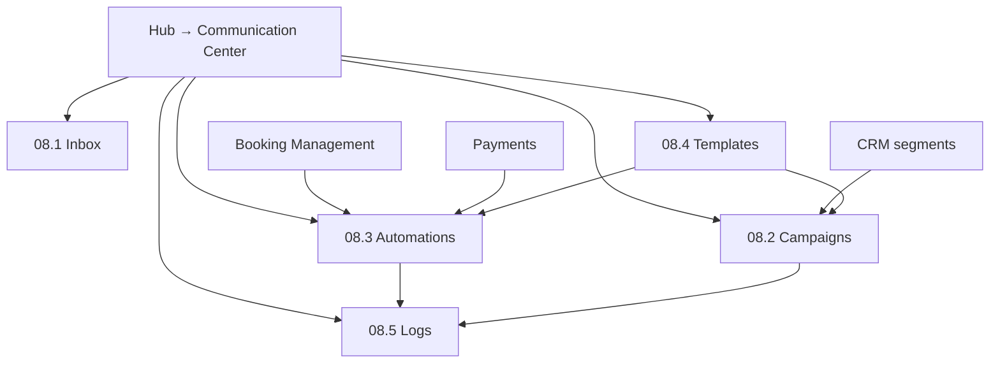

# Module 08 — Communication Center

**Hub module:** Communication Center  
**Target hub route:** `/business-connect/communication`  
**Current implementation gap:** BusinessHub currently links to `/temple/communication`, which is temple PR/devotee communication. Business Connect should get a separate SMB communication module.  
**Previous:** [07-crm.md](./07-crm.md) · **Next:** —

**Implementation reference:** Existing temple module (`src/pages/temple/communication/*`) can inform message/rule/template/log patterns, but business labels, routes, audience models, and variables must be SMB/customer-focused.

---

## Module map

```
Module 08 — Communication Center
│
├── 08.1 Inbox                        /business-connect/communication
├── 08.2 Campaigns                    /business-connect/communication/campaigns
├── 08.3 Automations                  /business-connect/communication/automations
├── 08.4 Templates                    /business-connect/communication/templates
└── 08.5 Logs & Delivery              /business-connect/communication/logs
```

| Sub-module | Nav label | Route |
|------------|-----------|-------|
| 08.1 | Inbox | `/business-connect/communication` |
| 08.2 | Campaigns | `/business-connect/communication/campaigns` |
| 08.3 | Automations | `/business-connect/communication/automations` |
| 08.4 | Templates | `/business-connect/communication/templates` |
| 08.5 | Logs & Delivery | `/business-connect/communication/logs` |

**Not in Business Connect:** temple notices, live darshan, public governance meetings, devotee experience feed, temple website generator.

---

## Field mapping (temple → business SMB)

| Temple communication | Business SMB communication |
|----------------------|----------------------------|
| Devotee | **Customer** |
| Offering / Seva | **Service / package** |
| TempleName | **BusinessName** |
| StructureName | **Branch / location** |
| Donor segment | **Customer segment** |
| Festival announcement | **Promotion / service update / seasonal campaign** |
| Live darshan / public meetings | — (not used) |

---

## 1. Business Context

SMB vendors need one place to manage customer conversations, campaign sends, transactional messages, templates, and delivery logs across WhatsApp, SMS, email, and future push channels. Communication is downstream of CRM, bookings, payments, and service listings.

---

## 2. Business Objectives

| Objective | Sub-module |
|-----------|------------|
| Track incoming/outgoing customer messages | 08.1 Inbox |
| Send targeted campaigns to CRM segments | 08.2 Campaigns |
| Automate booking/payment reminders | 08.3 Automations |
| Standardize reusable message content | 08.4 Templates |
| Audit delivery, failures, and retries | 08.5 Logs & Delivery |

---

## 3. Personas

| Persona | Sub-module |
|---------|------------|
| Front desk / counter staff | 08.1 |
| Operations lead | 08.1, 08.3, 08.5 |
| Owner / marketing staff | 08.2, 08.4 |

---

## 4. User Journey



---

## 5. Screen Inventory

| ID | Screen | Target component |
|----|--------|------------------|
| 08.1 | Unified inbox | `BusinessCommunicationInbox.tsx` |
| 08.2 | Campaigns | `BusinessCampaigns.tsx` |
| 08.3 | Automations | `BusinessCommunicationRules.tsx` |
| 08.4 | Templates | `BusinessMessageTemplates.tsx` |
| 08.5 | Logs & Delivery | `BusinessCommunicationLogs.tsx` |

Existing temple components should not be mounted directly under Business Connect without label/data cleanup.

---

## 6. UI Requirements

### 08.1 Inbox columns

Customer · Channel · Latest message · Related record · Owner · Priority · Status · Last activity

### 08.2 Campaign columns

Campaign ID · Name · Segment · Channels · Status · Scheduled · Sent · Delivered · Failed

### 08.3 Automation columns

Rule ID · Rule name · Trigger · Scope · Channel · Template · Timing · Status

### 08.4 Template columns

Template ID · Name · Category · Channel · Language · Variables · Approval status · Status

### 08.5 Log columns

Log ID · Message ID · Customer · Channel · Recipient · Status · Sent at · Delivered at · Error

### Channels

`WhatsApp` · `SMS` · `Email` · `Push` (future)

### Message statuses

`Draft` · `Scheduled` · `Sending` · `Sent` · `Delivered` · `Read` · `Failed` · `Cancelled`

### Business template variables

`{{CustomerName}}` · `{{BusinessName}}` · `{{ServiceName}}` · `{{PackageName}}` · `{{BookingDate}}` · `{{SlotTime}}` · `{{Amount}}` · `{{PaymentLink}}` · `{{BranchName}}`

---

## 7. Data Model

```typescript
interface BusinessMessage {
  id: string;
  title: string;
  channel: "WhatsApp" | "SMS" | "Email" | "Push";
  customerId?: string;
  segmentId?: string;
  relatedModule?: "Booking" | "CRM" | "Payment" | "Service" | "Campaign";
  relatedRecordId?: string;
  subject?: string;
  body: string;
  status: "Draft" | "Scheduled" | "Sending" | "Sent" | "Delivered" | "Read" | "Failed" | "Cancelled";
  scheduledAt?: string;
  sentAt?: string;
  createdAt: string;
}

interface BusinessCommunicationRule {
  id: string;
  name: string;
  trigger: "Booking Created" | "Booking Reminder" | "Payment Link Sent" | "Payment Success" | "Booking Cancelled" | "Lead Created";
  scope: "All Services" | "Service Category" | "Specific Service" | "Customer Segment";
  channel: "WhatsApp" | "SMS" | "Email" | "Push";
  templateId: string;
  timing: "Immediate" | "Before 1 hour" | "Before 2 hours" | "Before 24 hours" | "After completion";
  status: "Active" | "Paused" | "Archived";
}
```

---

## 8. Business Rules

| ID | Rule |
|----|------|
| BR-COMM-01 | Onboarding complete before communication hub access |
| BR-COMM-02 | CRM customer/segment is required for targeted outbound campaigns |
| BR-COMM-03 | Transactional rules may be triggered by booking/payment events |
| BR-COMM-04 | WhatsApp templates requiring provider approval cannot be sent until approved |
| BR-COMM-05 | Failed messages remain visible in logs and support retry when provider allows |
| BR-COMM-06 | Business Connect cannot use temple-only audience labels such as Devotees, Donors, Seva Participants, Darshan Visitors |
| BR-COMM-07 | Message variables must match the selected audience and related module |

---

## 9. Workflow States

| Entity | States |
|--------|--------|
| Campaign | `Draft` → `Scheduled` → `Sending` → `Sent` / `Failed` / `Cancelled` |
| Automation rule | `Active` · `Paused` · `Archived` |
| Template | `Draft` · `Pending Approval` · `Approved` · `Rejected` · `Archived` |
| Message log | `Queued` · `Sent` · `Delivered` · `Read` · `Failed` |

---

## 10. API Requirements

| Method | Endpoint | Purpose |
|--------|----------|---------|
| GET | `/v1/business/communication/inbox` | List conversations |
| POST | `/v1/business/communication/messages` | Send or schedule message |
| GET | `/v1/business/communication/campaigns` | List campaigns |
| POST | `/v1/business/communication/campaigns` | Create campaign |
| GET | `/v1/business/communication/rules` | List automation rules |
| POST | `/v1/business/communication/rules` | Create automation rule |
| GET | `/v1/business/communication/templates` | List templates |
| POST | `/v1/business/communication/templates` | Create template |
| GET | `/v1/business/communication/logs` | Delivery and audit logs |

Provider integrations should be abstracted behind backend services; UI should not hold SMS/WhatsApp/email secrets.

---

## 11. Permissions

| Permission | Scope |
|------------|-------|
| `communication.read` | View inbox, campaigns, templates, logs |
| `communication.send` | Send manual messages |
| `communication.campaign.write` | Create/update campaigns |
| `communication.rule.write` | Create/update automations |
| `communication.template.write` | Create/update templates |
| `communication.logs.read` | View delivery logs |

---

## 12. Notifications

| Trigger | Notification |
|---------|--------------|
| Message sent | Toast: `Message sent` |
| Campaign scheduled | Toast: `Campaign scheduled` |
| Automation rule activated | Toast: `Rule activated` |
| Provider failure | Toast: `Message failed. Check delivery logs.` |
| Template approval update | Future email/in-app notification |

---

## 13. Reports

| Report | Source |
|--------|--------|
| Delivery rate by channel | Logs |
| Failed messages and retry count | Logs |
| Campaign performance | Campaigns + logs |
| Customer response trend | Inbox |
| Automation volume | Rules + logs |

---

## 14. Acceptance Criteria

**AC-COMM-01** — BusinessHub communication route should point to `/business-connect/communication`, not `/temple/communication`.  
**AC-COMM-02** — Business module labels use Customer, Service, Package, Segment, Branch, and BusinessName.  
**AC-COMM-03** — Temple-only pages are excluded from Business Connect communication.  
**AC-COMM-04** — Campaigns can target CRM segments.  
**AC-COMM-05** — Automations can trigger from booking/payment events.  
**AC-COMM-06** — Templates expose business variables only.  
**AC-COMM-07** — Logs show channel, recipient, status, sent time, delivery time, and failure reason.

---

## 15. Test Scenarios

| ID | Scenario |
|----|----------|
| TS-COMM-01 | Open Communication Center from BusinessHub; verify route is `/business-connect/communication` |
| TS-COMM-02 | Create manual WhatsApp message for a customer; verify log entry |
| TS-COMM-03 | Schedule campaign for a CRM segment; verify status `Scheduled` |
| TS-COMM-04 | Create booking confirmation automation; verify business template variables |
| TS-COMM-05 | Simulate provider failure; verify failed log and retry visibility |
| TS-COMM-06 | Confirm no temple-only labels/pages appear in Business Connect communication |
