# Flow-wise Team Context — DigiDevalaya Business Connect

**Product:** DigiDevalaya Business Connect  
**Audience:** BA/PO, UI team, API team, QA, AI assistants  
**Version:** 2.0

---

## Hub modules

| # | Hub module | Document | Route |
|---|------------|----------|-------|
| 1 | Register | [01-register.md](./01-register.md) | `/temple-register` |
| 2 | Login | [02-login.md](./02-login.md) | `/login` |
| 3 | Business profile complete | [03-business-profile.md](./03-business-profile.md) | `/business/profile` |
| 4 | Settings — finance settings | [04-finance-settings.md](./04-finance-settings.md) | `/temple/settings/finance` |
| 5 | Service Listings | [05-service-listing.md](./05-service-listing.md) | `/business-connect/services` |
| 6 | Booking Management | [06-bookings.md](./06-bookings.md) | `/business-connect/bookings` |
| 7 | CRM | [07-crm.md](./07-crm.md) | `/business-connect/crm` |
| 8 | Communication Center | [08-communication.md](./08-communication.md) | `/business-connect/communication` |

**Module 05 sub-modules:** 05.1 Dashboard · 05.2 Service listing · 05.3 Add-ons — see [05-service-listing.md](./05-service-listing.md) module map.

**Module 06 sub-modules:** 06.1 Today · 06.2 All Bookings (counter + online) · 06.3 Counter · 06.5 Calendar — no separate Online nav.

**Module 07 sub-modules:** 07.1 Customers · 07.2 Segments · 07.3 Insights.

**Module 08 sub-modules:** 08.1 Inbox · 08.2 Campaigns · 08.3 Automations · 08.4 Templates · 08.5 Logs & Delivery.

---

## Module document template (15 sections)

Every flow file uses this structure:

```
Module
│
├──  1. Business Context
├──  2. Business Objectives
├──  3. Personas
├──  4. User Journey
├──  5. Screen Inventory
├──  6. UI Requirements
├──  7. Data Model
├──  8. Business Rules
├──  9. Workflow States
├── 10. API Requirements
├── 11. Permissions
├── 12. Notifications
├── 13. Reports
├── 14. Acceptance Criteria
└── 15. Test Scenarios
```

| § | Owner | Contents |
|---|-------|----------|
| 1 | BA/PO | Why this module exists, scope, dependencies |
| 2 | BA/PO | Measurable goals and success metrics |
| 3 | BA/PO | Who uses it and their goals |
| 4 | BA/PO | Step-by-step journey (happy path + branches) |
| 5 | UI | Screens, routes, entry/exit |
| 6 | UI + BA | Fields, layout, validation messages, states |
| 7 | Both | Entities, enums, relationships |
| 8 | BA/PO | Product logic, gates, exclusivity |
| 9 | Both | Status machines, flags, transitions |
| 10 | Backend | Endpoints, request/response, errors |
| 11 | BA/PO | Who can do what |
| 12 | Both | Toasts, emails, SMS (if any) |
| 13 | BA/PO | Analytics / exports (if any) |
| 14 | BA/PO | Given / When / Then |
| 15 | QA | Test cases derived from §14 |

---

## Master journey

```mermaid
flowchart LR
  Register["1 Register"] --> Login["2 Login"]
  Login --> Hub["Temple Hub"]
  Hub --> Profile["3 Business Profile"]
  Profile --> Plan["Plan on Hub"]
  Plan --> Finance["4 Finance Settings"]
  Finance --> Services["5 Service Listings"]
  Services --> Bookings["6 Booking Management"]
  Bookings --> CRM["7 CRM"]
  CRM --> Communication["8 Communication Center"]
```



| Cross-cutting topic | Documented in |
|---------------------|---------------|
| Hub modals & route guard | 02-login §4, §8, §9 |
| Plan / subscription step | 03-business-profile §4, §8, §9 |
| Service Listings sub-modules | 05-service-listing module map |
| Service status (BE-owned) | 05.2 §8–§10 |
| Booking Management (SMB UI) | 06-bookings module map |
| CRM customer records, segments, insights | 07-crm module map |
| Business communication, campaigns, templates | 08-communication module map |
| Add-ons | 05.3 |

---

## Team playbook

| Role | Read |
|------|------|
| BA/PO | §1–§4, §8, §14 |
| UI | §5–§6, §9 |
| API | §7–§10 |
| QA | §14–§15 |

**AI:** Attach **one** hub module doc. For Service Listings, Booking Management, or CRM, specify sub-module when scoping UI or API work.

---

## Design system

UI design system guide — color, typography, spacing, layout, and components:

**[DESIGN-SYSTEM.md](../DESIGN-SYSTEM.md)** — primary UI reference  
**[TABLE-PAGE-SPEC.md](../TABLE-PAGE-SPEC.md)** — table & workspace page anatomy  
**[ERP-DESIGN-SYSTEM-SPEC.md](../ERP-DESIGN-SYSTEM-SPEC.md)** — extended ERP / dark-theme spec

---

## API conventions (all modules)

- Base URL: `/v1` · Auth: `Bearer` token
- Errors: `{ error: { code, message, fields } }`
- Field names in §6 and §10 must match exactly
- **Status fields** (e.g. service `Draft`/`Active`/`Inactive`): assigned by backend only — UI triggers actions (`publish`, `deactivate`) and displays `status` from API responses; never send `status` in create/update bodies (see module 05 §8, §10)
